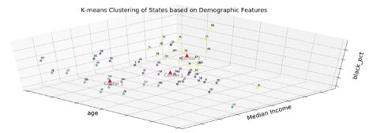

# ChicagoCrime

## Introduction

		This research aims at reevaluating public safety problem in Chicago, more specifically, identifying key features behind blocks with high crime rate and devising public policy solutions accordingly. In most social science literature, demographics are known to exhibit strong correlations with crime; yet, we believe demographics alone are not sufficient to explain this complex issue. Therefore alongside traditional demographics,we introduce two newgroups – infrastructure and traffic flow – to better capture neighborhood characteristics. 
 

		Three types of machine learning techniques are used in this research: unsupervised clustering, supervised regression, and synthetic control method. In unsupervised learning, we apply hierarchical clustering and K-means to select states shared similar demographic features with Illinois. Then, scope is narrowed down to Chicago in the supervised regression part in order to key factors behind its high crime rate. Lastly, we constructed a simulated Chicago using synthetic control method with data of real cities selected from unsupervised learning. This method helps us better understand results of a policy or project.

## Data Source

In this project, we use three data sources:
1. Main Research Data

	1. Crime data (xls):  FBI Offenses Known to Law Enforcement - Crime in the U.S. Archive, including 2010~2018 
	Data downloaded from <https://ucr.fbi.gov/crime-in-the-u.s>
	2. ACS Census data (API): Demographic features  
	Data retrieved via Census API as: <https://www.census.gov/data/developers/data-sets/acs-1year.html>
	3.  
3. Supportive Data
	1. Census tract boundaries: Census tract for Chicago
4. Property Value: <https://www.experian.com/blogs/ask-experian/research/median-home-values-by-state/>
5. State-County-City Match: From government website
6. Taxi Trips: From [Chicago Data Portal]<https://data.cityofchicago.org/>

## Directory
1. Data: all data used in this research except API data.  

2. Codes:
	1. Read files
		1. read_FBI_data.py

			Read in FBI xlsx files, clean and transform data.

		2. read_facility_data.py

			Retrieve city facility data via 

	2. Unsupervised_Cluster (for selecting States with similar demographic features with Illinois)

		1. Function for by-county crime rate plotting
		
		

		2. Function for by-state crime rate plotting
		
		

		3. Hierarchical Clustering
		
		

		4. K-means Clustering
		
		

	3. Supervised_And_Synth include linear regression model and synthetic control method.

		1. Linear model construction
		
		

		2. Model Regularization
		
		
		
		3. Bootstrapping
		4. Synth Method
3. STATA: This folder include the do files showing the further statistical analysis for Bootstrapping and Synthetic Control Method.
4. Excel: This folder include the xlsx files we use to draw our trends.
5. PDFs: Final presentation and Final report.
