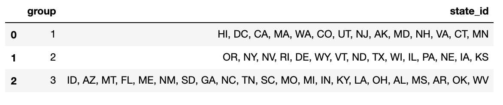
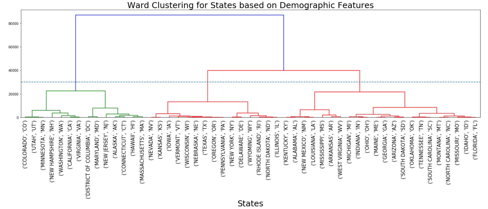
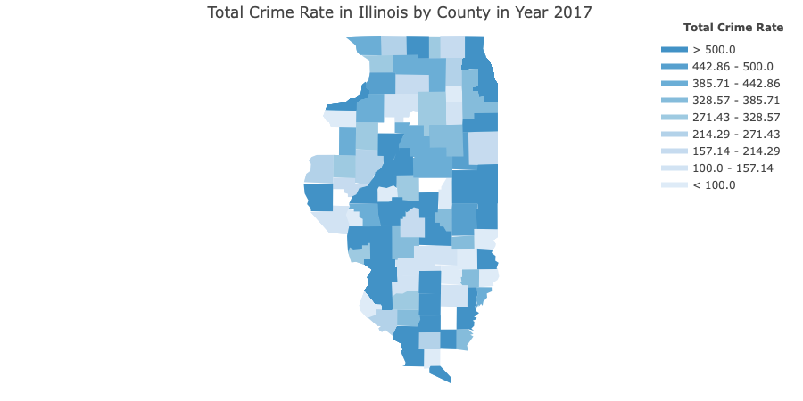
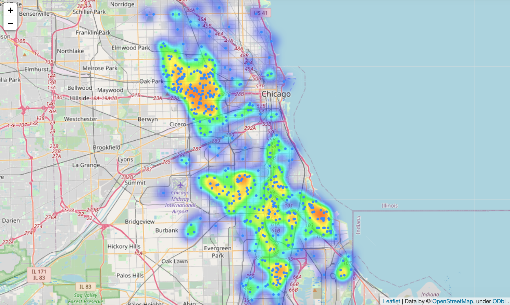
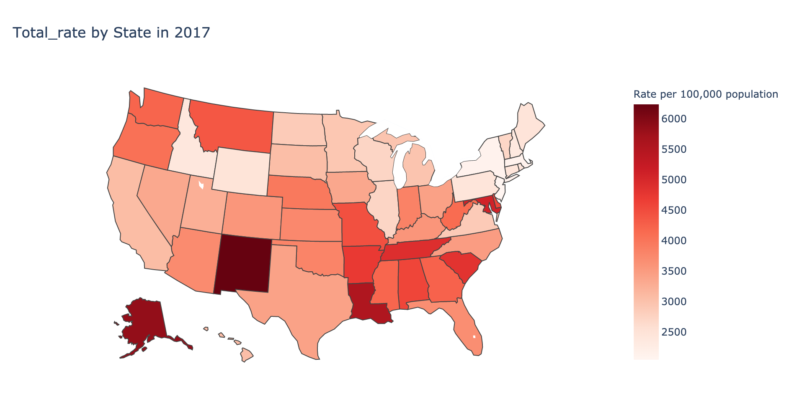
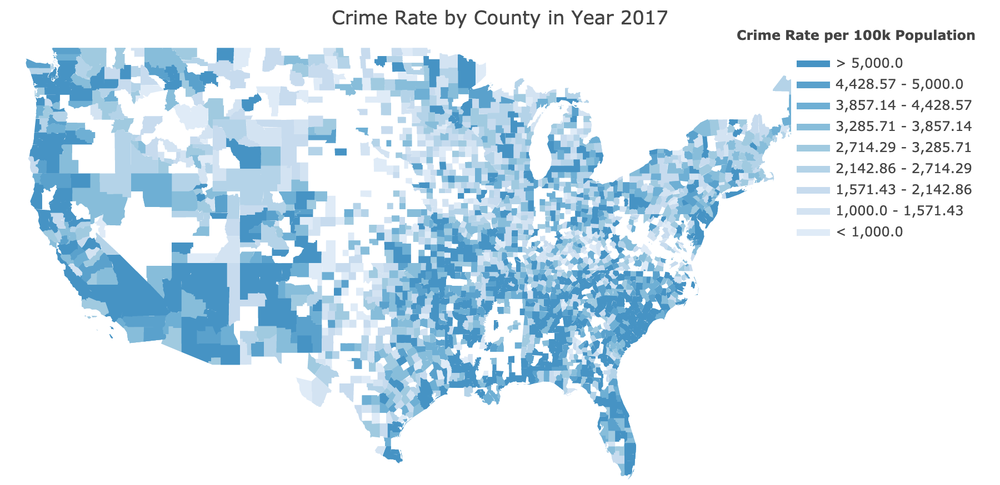

# ChicagoCrime

# TweePyTrends

TweePyTrends is developed by Donimic, Ruize, Jiaqi, and Ya-han as our group project for CAPP30122.

## Introduction

<p>		The goal of this project is to see how people on social media (Twitter) interact with a certain topic. We then compare it with Google search trends to get a more complete picture on the topic and to evaluate how it differs from Twitter users. This is important as there is a pervasive perception of the closed-loop nature of Twitter. We utilize data visualization techniques to make our result more presentable and readable to non-technical users, such as policy makers and marketers, and thus they can easily keep track of their ongoing projects with real-time Twitter scraping or compare the result with that of similar topics in the past on Twitter and Google. </p><br>

<p>		In this project, we utilise visualizations such as a word cloud, a line chart of the interest/frequency over time, and a table presenting the key opinion leaders of the topic. Through the word cloud, users can see what words are related to the topic and how often they are mentioned with the topic users care about. As for the line chart of the interest/frequency over time, users are able to see which the search and Twitter interest of the topics over time. Users are also able to utilize our key opinion leaders chart to find out who has the greatest impact in the field or of the topic on Twitter.</p>

## Data Source

TweePyTrends supports real-time data collection model and sample viewing model. 

In this app, we use three data sources:
1. Pytrends (API): retrieves data from Google Trends
2. Twitterscrapper (API): retrieves data from all historical tweets (work significantly slow)
3. Crawler (Web scrapping): scrap real-time data from twitter


## Usage

After installing all packages (as requirements.txt), run
```command
python3 GUI.py
```
To retrieve historical Tweets, run below **before** entering the app
```command
python3 go2.py word start_date end_date
```
### Suggest Trial <br>
chicago, 2020-03-01, 2020-03-05 <br>
coronavirus, 2020-02-01, 2020-03-05


## Common Errors

### Google Trends

1. Pytrends and Pandas Inconsistency <br>
If encounter error message *"No module named 'pandas.io.json.normalize'"*, Please go to site-packages/pytrends/request.py and change line 13 into *pandas.io.josn.normalize*. This is a system inconsistency between two packages and we have not found other ways to solve.

### Real-time Twitter 

1. Crawler Frozen <br>
Crawler can get frozen because of too many attempts within a short period. In this case, the app will show an error message picture saying "Crawler is frozen, try 5 mins later".

2. Pandas Inconsistency <br>
Pandas sometimes performs inconsistently with the crawler, but there is nothing inherently wrong with that. If see error message *"Length mismatch: Expected axis has 0 elements, new values have 2 elements"*. Please click the button again and it should work.

### TwitterScrapper

1. TwitterScrapper <br>
TwitterScrapper works less efficiently since it collects massive historical data. Because of this, UI works far less stable with TwitterScrapper connected. That is why we seperate them into two functions. <br>
**To check historical tweets, user must run command line as below**

```command
python3 go2.py word start_date end_date
```

If forget to do so, the error message will be *"QPixmap::scaleWidth: Pixmap is a null pixmap"*.
All input should have same form as in app. 

2.. Crash<br>
In the case of API crashes, the app will return error message picture.

## Video Demo

[Video Demo][1] produced by Laura.
[1]: https://drive.google.com/file/d/1jU-BqtF_r2aM-snOW0pBP6H-jinOm8nu/view


## UI Page Details
Trump 2020-03-01 2020-03-05 as example
1. Welcome Page <br> 

2. Input Page <br> 
	* Word is case insensitive
	* Date must conform yyyy-mm-dd
	* End date >= Start date <br>

3. Data Source Page<br> 

4. Google Trends Page<br> 

5. Historical Tweets Page<br>

6. Real-time Tweets Page <br>


## Requirements and Versions

Please check requirements.txt
